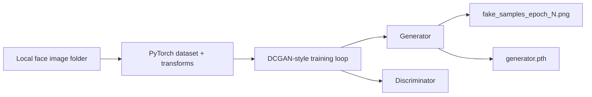

# Anime-Face-Generator

## Problem
This project tackles generative image synthesis for anime-style faces. The implementation trains a GAN on a local image dataset and periodically exports generated samples so the quality of the synthetic faces can be monitored across epochs.

## System Design

- Architecture:
  - everything is implemented in a single training script: [`Anime_face_gen.py`](C:\Users\91965\cars24\github-readme-batch\Anime-Face-Generator\Anime_face_gen.py)
  - a custom dataset scans a local folder for image files
  - a generator and discriminator are trained adversarially in PyTorch
  - sample outputs are saved after each epoch
- Components:
  - model: DCGAN-style generator and discriminator
  - data: local anime-face image directory
  - training outputs: saved sample grids and a serialized generator checkpoint
- There is no LLM, DB, API layer, RAG system, or multi-agent architecture in this repo.

## Approach
- Why multi-agent?
  - Multi-agent is not used. This is a classic GAN training workflow with two neural networks trained in opposition inside one loop.
- Why RAG?
  - RAG is not applicable because this repository generates images from latent noise vectors rather than retrieving documents.
- What the code actually does:
  - loads and normalizes training images to `64x64`
  - trains a convolutional generator from random noise
  - trains a discriminator to separate real images from generated ones
  - exports visual checkpoints after each epoch
  - saves the trained generator as `generator.pth`

## Tech Stack
- Python
- PyTorch
- torchvision
- Pillow
- tqdm

## Demo
- Put training images in the local directory referenced by the script
- Run `Anime_face_gen.py`
- Watch epoch-by-epoch sample grids such as `fake_samples_epoch_1.png`
- Use the saved `generator.pth` checkpoint for future inference or continued training

## Results
- The current repo shows a complete training pipeline for anime-face generation, but it does not include a benchmark, FID score, or evaluation sheet.
- The main outputs are:
  - generated sample images saved after each epoch
  - a trained generator checkpoint for reuse

## Learnings
- What worked:
  - the script uses a recognizable DCGAN structure that is easy to train and inspect
  - saving sample images every epoch makes training progress visible
  - automatic CPU/GPU selection keeps the script portable
- What did not:
  - the dataset path is hard-coded to a local Windows folder
  - there is no inference-only script or notebook for generating faces from a saved model
  - the previous README contained only the project name and no useful documentation

## Supporting Docs
- [Architecture diagram](docs/architecture.png)
- [Evaluation logs and outputs](docs/evaluation.md)
- [Sample inputs and outputs](docs/sample_io.md)
